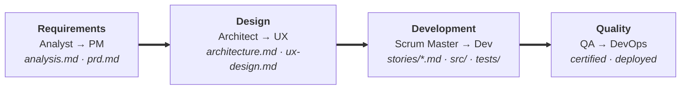
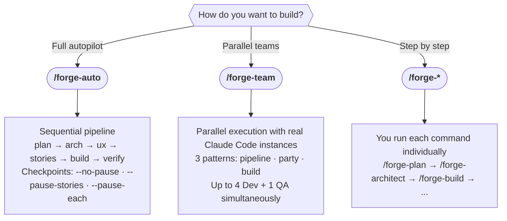
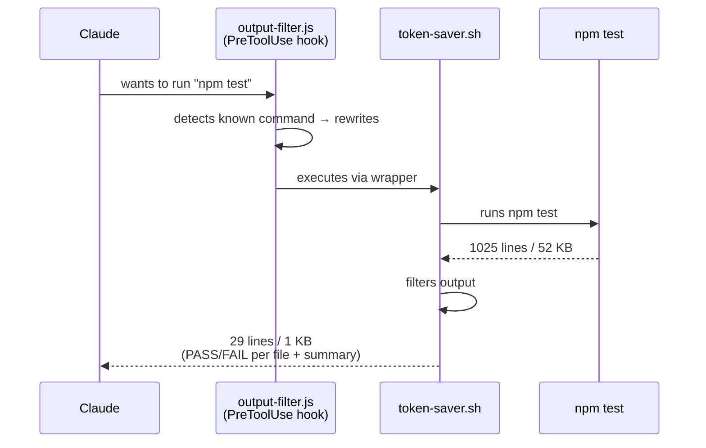
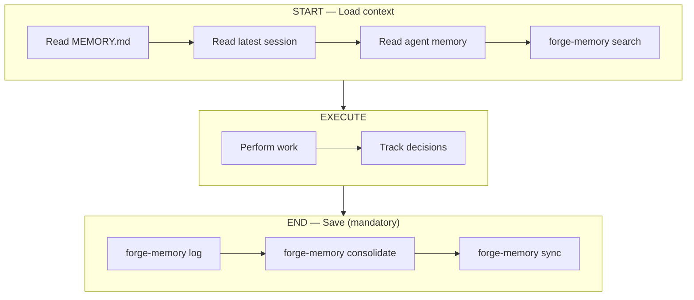
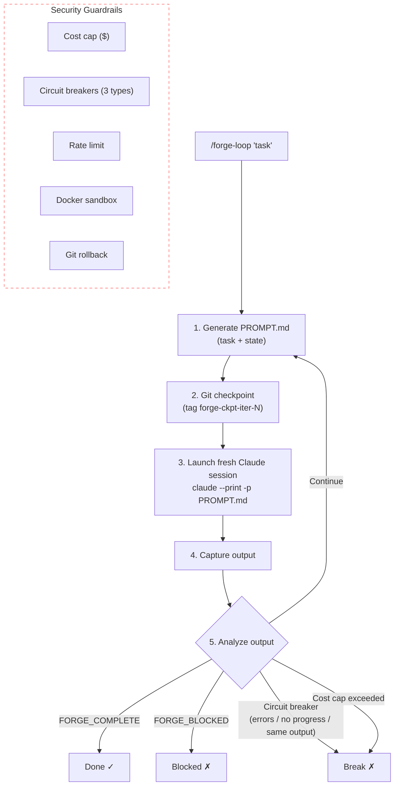

# FORGE

**Framework for Orchestrated Resilient Generative Engineering**

[](https://github.com/fwehrling/forge/releases)
[](LICENSE)
[](#prerequisites)
[](#commands)
[](#multi-agent-pipeline)
[](https://n8n.io)
[](#token-saver)
[](#memory-system)
[](https://github.com/fwehrling/forge/stargazers)
[](https://github.com/fwehrling/forge/issues)

A multi-agent AI development framework for [Claude Code](https://docs.anthropic.com/en/docs/claude-code). FORGE orchestrates specialized AI agents through a structured pipeline — from requirements to deployment — with persistent memory, autonomous iteration, and built-in quality gates.

```
/forge-auto "Build a REST API with authentication"
```

That's it. FORGE handles the rest.

---

## How It Works

FORGE assigns specialized AI agents to each phase of software development. Each agent produces versioned artifacts that downstream agents consume, eliminating context loss between phases.



Each agent is a lightweight Markdown persona loaded on demand from `~/.claude/skills/forge/references/agents/`.

### Execution Modes

FORGE offers three ways to drive development:



**Autopilot checkpoints** (`/forge-auto`):
- `--no-pause` — fully autonomous, no checkpoints
- `--pause-stories` — pause for approval after story decomposition (default)
- `--pause-each` — pause after every pipeline phase

**When to use which:**
- `/forge-auto` — "Build this project from A to Z" (multi-phase, multi-agent, sequential)
- `/forge-team pipeline` — "Build this project in parallel" (multi-phase, multi-agent, parallel stories)
- `/forge-team build` — "Build these stories in parallel" (parallel Dev + QA)
- `/forge-team party` — "Analyze this topic from multiple perspectives" (parallel debate)
- Manual — "I want full control over each step"

---

## Features

### Multi-Agent Pipeline
12 specialized agents (Analyst, PM, Architect, UX, Scrum Master, Dev, QA, Quick QA, Reviewer, Orchestrator, DevOps, Security) that collaborate through artifacts.

### Persistent Memory
Two-layer memory system (Markdown + vector search) that survives across sessions. FORGE always knows where it left off. See [Memory System](#memory-system) for details.

```
.forge/memory/
  MEMORY.md              # Long-term project knowledge
  sessions/YYYY-MM-DD.md # Daily session logs (auto-generated)
  agents/dev.md          # Agent-specific context
  index.sqlite           # Vector search index (auto-generated)
```

### Autopilot Mode (`/forge-auto`)
Give FORGE an objective, and it drives the entire pipeline autonomously — choosing the right agent for each phase, running quality gates, and iterating until done.

### Manual Control (`/forge-*`)
Full manual control when you want it. Every step of the pipeline is a standalone command.

### Autonomous Loops (`/forge-loop`)
Secured iteration engine running **outside** Claude Code. Cost caps, circuit breakers, Docker sandbox, and git rollback. See [Autonomous Loops](#autonomous-loops) for details.

### Scale-Adaptive Intelligence
FORGE auto-detects project complexity and adjusts its approach:

| Track          | When                       | Agents Used            |
| -------------- | -------------------------- | ---------------------- |
| **Quick**      | Bug fix, hotfix (<1 day)   | Dev only               |
| **Standard**   | Feature, module (1-5 days) | PM, Architect, SM, Dev, QA |
| **Enterprise** | System, platform (5+ days) | All + Security + DevOps |

### Test-Driven Pipeline
Tests are integrated at every stage — not just verification. The SM specifies test cases, the Dev writes and runs them (TDD), and the QA audits and extends coverage.

### Agent Teams (`/forge-team`)
True parallel execution using real Claude Code instances (not subagents). Three patterns:

| Pattern      | Trigger                         | Description                                    |
| ------------ | ------------------------------- | ---------------------------------------------- |
| **Pipeline** | `/forge-team pipeline "goal"`   | Full pipeline with parallel story development  |
| **Build**    | `/forge-team build STORY-001 …` | Parallel story implementation + integrated QA  |
| **Party**    | `/forge-team party "topic"`     | Multi-perspective analysis with debate         |

Requires `CLAUDE_CODE_EXPERIMENTAL_AGENT_TEAMS=1` in `~/.claude/settings.json` env.

### Security Model
5-layer defense: input validation, sandbox isolation, credential management, audit/rollback, and human gates. Autonomous loops run in Docker sandboxes with network whitelisting.

### Token Saver

Shell commands like `git log`, `npm test`, or `cargo build` produce verbose output that wastes tokens. Token Saver intercepts known commands via a Claude Code PreToolUse hook, executes them through a filtering wrapper, and returns only the essential lines (errors, summaries, status changes).

Installed automatically by `/forge-init` and `install.sh`. Zero external dependencies (Node.js + Bash only).

**How it works:**



**Benchmarks** (real project — 696 commits, 713 Jest tests):

| Command | Before | After | Reduction |
|---------|--------|-------|-----------|
| `npm test` (713 tests passing) | 1025 lines / 52 KB | 29 lines / 1 KB | **-97%** |
| `git diff` (20 commits) | 11,268 lines / 420 KB | 201 lines / 7 KB | **-98%** |
| `git log -10` | 112 lines | 20 lines | **-82%** |
| `npm install` | 17 lines | 3 lines | **-76%** |

**What the AI still sees:**

| Scenario | Preserved information |
|----------|----------------------|
| Tests pass | PASS/FAIL per file, test count, duration |
| Tests fail | Failed file + error details (Expected/Received, stack trace, up to 60 lines) |
| `git diff` | Diff headers, hunk markers, changed lines (capped at 200 lines with truncation notice) |
| `git log` | Commit hash + commit message (no Author/Date/body) |
| `git status` | Branch, modified/added/deleted files, tracking info |
| Build errors | All error and warning lines preserved |

The AI can bypass the filter at any time by using a pipe (e.g., `git diff | cat`), since complex commands with `|`, `&&`, or `;` are passed through unfiltered.

**Covered commands:**

| Category | Commands |
|----------|----------|
| Git | `git status`, `git diff`, `git log` |
| Node.js | `npm test`, `npm install`, `npx jest`, `npx vitest` |
| pnpm | `pnpm test`, `pnpm install`, `pnpm add`, `pnpm run test` |
| Yarn | `yarn test`, `yarn install` |
| Bun | `bun test`, `bun install` |
| Python | `pip install`, `pytest`, `python -m pytest` |
| Go | `go test` |
| Rust | `cargo test`, `cargo build` |
| Docker | `docker build` |
| Make | `make`, `make test` |
| Java | `mvn test`, `mvn install`, `gradle test`, `gradle build` |
| .NET | `dotnet test`, `dotnet build` |
| Swift | `swift test`, `swift build` |
| TypeScript | `tsc` |

**Safety guarantees:**
- Passthrough by default — unknown commands are untouched
- Complex commands (pipes `|`, chains `&&`) are never filtered
- If filter output is empty, the original output is returned in full
- If the hook crashes, exit 0 (passthrough — fail open, never fail closed)
- Exit code of the original command is always preserved

**Files:**

```
~/.claude/hooks/
  output-filter.js    # PreToolUse hook — detects and rewrites commands
  token-saver.sh      # Wrapper — executes command, filters output
```

---

## Prerequisites

- [Claude Code](https://docs.anthropic.com/en/docs/claude-code) CLI
- Git
- macOS, Linux, or **Windows via [WSL](https://learn.microsoft.com/en-us/windows/wsl/install)** (Git Bash is not supported)
- Python 3.9+ (optional — for [vector memory search](#vector-search-optional))
- Docker (optional — for sandbox isolation in autonomous loops)

---

## Installation

### Option A — Skills only (quick)

Copy the skills to your Claude Code configuration. Markdown memory works out of the box; vector search requires [additional setup](#vector-search-optional).

Using the [Skills CLI](https://github.com/anthropics/skills) (if available):

```bash
npx skills add fwehrling/forge -g --all
```

Or manually:

```bash
git clone https://github.com/fwehrling/forge.git /tmp/forge
cp -r /tmp/forge/skills/* ~/.claude/skills/
```

> **Note**: Option A installs skills only. It does **not** install Token Saver (output filtering hooks) or the update-check hook. Use [Option B](#option-b--full-install-recommended) for the complete setup.

### Option B — Full install (recommended)

The install script copies skills, checks your environment, and optionally sets up vector memory:

```bash
git clone https://github.com/fwehrling/forge.git /tmp/forge
bash /tmp/forge/install.sh
```

The installer will:
1. Detect your OS (macOS, Linux, WSL)
2. Copy all FORGE skills to `~/.claude/skills/`
3. Check for Python 3.9+ and offer to set up vector memory
4. Install Token Saver (output filtering hooks to reduce token consumption)
5. Verify the installation and display a summary

### Initialize a project

```bash
# Inside your project with Claude Code
/forge-init
```

FORGE auto-detects your stack (language, framework, package manager) and generates:
- `.forge/config.yml` — project configuration
- `CLAUDE.md` — project conventions for Claude
- `.forge/memory/MEMORY.md` — persistent memory

### Build Something

```bash
# Autopilot — FORGE drives everything
/forge-auto "Implement user authentication with JWT"

# Or step by step
/forge-analyze                 # Domain research + requirements elicitation
/forge-plan                    # Generate requirements (PRD)
/forge-architect               # Generate architecture
/forge-ux                      # UX design, wireframes, accessibility
/forge-stories                 # Decompose into stories
/forge-build STORY-001         # Implement story
/forge-verify STORY-001        # QA audit + certification
/forge-deploy                  # Deploy to staging → production

# Quick commands
/forge-quick-spec              # Quick track: spec + implement directly
/forge-quick-test              # Zero-config testing
/forge-audit                   # Security audit (Enterprise track)
/forge-loop "Fix all tests"    # Autonomous iteration loop
/forge-resume                  # Resume work on an existing FORGE project
```

---

## Updating

FORGE checks for updates automatically at session startup (once every 24 hours). If a new version is available, you'll see a non-blocking notification suggesting to run `/forge-update`.

### Auto-update (recommended)

```bash
# Inside Claude Code
/forge-update
```

This will:
1. Clone the latest version from GitHub
2. Compare installed skills with the new ones
3. Show a summary of changes (modified, new, removed)
4. Copy updated skills to `~/.claude/skills/`
5. Clean up temporary files

### Manual update

```bash
git clone https://github.com/fwehrling/forge.git /tmp/forge
bash /tmp/forge/install.sh
```

---

## Memory System

FORGE uses a Markdown-based memory system for cross-session continuity. Every FORGE **agent command** reads memory at start and writes updates at end. Utility commands (`/forge-status`, `/forge-resume`, `/forge-init`, `/forge-memory`, `/forge-update`) read memory but do not write back.

### How It Works



Every agent skill enforces the END protocol. Utility commands (`/forge-status`, `/forge-resume`, `/forge-init`, `/forge-memory`, `/forge-update`) read memory but do not write back via `forge-memory log`. A Claude Code Stop hook provides an additional safety net — when a session ends, it automatically runs `consolidate` + `sync` for any FORGE project detected in the working directory.

### Vector Search (optional)

Vector search adds semantic retrieval on top of the Markdown layer. It indexes all `.md` files into a local SQLite database using embeddings, enabling fuzzy context lookups.

**Setup** (requires Python 3.9+):

```bash
bash ~/.claude/skills/forge/scripts/forge-memory/setup.sh
```

This creates an isolated venv, installs dependencies (`sentence-transformers`, `sqlite-vec`), downloads the embedding model (~80 MB), and adds the `forge-memory` CLI to your PATH via `~/.local/bin`.

```bash
# Usage (auto-detects project from CWD)
forge-memory sync --verbose                         # Index all .md files
forge-memory search "auth decisions" --pretty       # Hybrid vector + keyword search
forge-memory status                                 # Index statistics
forge-memory log "STORY-001 done" --agent dev       # Append to session log
forge-memory consolidate --verbose                  # Merge session logs into MEMORY.md
```

### Session Logging

FORGE agents automatically log their activity to daily session files. The `consolidate` command merges session entries into MEMORY.md, grouped by story.

```
.forge/memory/sessions/YYYY-MM-DD.md:
  - **14:32:10** [dev] (STORY-001) — Implemented auth module: 12 tests, 87% coverage
  - **15:10:45** [qa] (STORY-001) — QA PASS: all criteria validated
```

The sync scope includes both `.forge/memory/` and `docs/` (stories, architecture, PRD), so all project artifacts are searchable via vector search.

### With vs Without Vector Search

| | Without vector search | With vector search |
| --- | --- | --- |
| **Setup** | Nothing extra | Python 3.9+ and `setup.sh` |
| **Context retrieval** | Reads full Markdown files | Reads files + semantic search across all fragments |
| **Best for** | Small projects, few memory files | Large projects, extensive session history |
| **Files used** | `.md` only | `.md` + `index.sqlite` (auto-generated) |
| **Speed** | Instant (file reads) | Fast (local embeddings, no network) |
| **Precision** | Exact (you get the whole file) | Targeted (relevant chunks ranked by similarity) |

---

## Commands

### Pipeline

| Command            | Agent     | Output                     | Description                          |
| ------------------ | --------- | -------------------------- | ------------------------------------ |
| `/forge-auto`      | All       | Full pipeline              | Autopilot mode (sequential)          |
| `/forge-team`      | All       | Full pipeline              | Parallel execution via Agent Teams   |
| `/forge-analyze`   | Analyst   | `docs/analysis.md`         | Domain research, requirements        |
| `/forge-plan`      | PM        | `docs/prd.md`              | Product requirements document        |
| `/forge-architect` | Architect | `docs/architecture.md`     | System architecture                  |
| `/forge-ux`        | UX        | `docs/ux-design.md`        | Wireframes, design system, a11y      |
| `/forge-stories`   | SM        | `docs/stories/*.md`        | Story decomposition with test specs  |
| `/forge-build`     | Dev       | Source code + tests         | Implementation (TDD)                 |
| `/forge-verify`    | QA        | Test report + verdict       | Quality audit and certification      |
| `/forge-deploy`    | DevOps    | Deployed application        | Staging + production deployment      |

### Orchestration & Tools

| Command                       | Description                                       |
| ----------------------------- | ------------------------------------------------- |
| `/forge-party "topic"`        | Multi-agent collaboration (2-3 in parallel)       |
| `/forge-loop "task"`          | Autonomous iteration loop with guardrails         |
| `/forge-quick-spec`           | Quick track: spec + implement directly            |
| `/forge-quick-test`           | Zero-config testing with auto framework detection |
| `/forge-review`               | Adversarial review of an artifact                 |
| `/forge-audit`                | Security audit: threat model, OWASP (Enterprise)  |
| `/forge-audit-skill <path>`   | Security audit of a third-party skill             |
| `/forge-memory`               | Vector memory: sync, search, status, log, consolidate |
| `/forge-init`                 | Initialize FORGE in a project                     |
| `/forge-resume`               | Resume work on an existing FORGE project          |
| `/forge-status`               | Sprint status, stories, metrics                   |
| `/forge-update`               | Update FORGE skills from latest release           |

---

## Architecture

### Project Structure

FORGE skills are installed globally in `~/.claude/skills/` (not inside the project). The project only contains the `.forge/` directory and generated artifacts:

```
your-project/
  .forge/
    config.yml              # FORGE configuration
    sprint-status.yaml      # Sprint tracking
    memory/                 # Persistent memory
      MEMORY.md             #   Project knowledge base
      sessions/             #   Daily session logs (auto-generated)
      agents/               #   Agent-specific context
      index.sqlite          #   Vector search index (auto-generated)
  docs/                     # Generated artifacts (indexed by vector search)
    analysis.md             # Analyst output
    prd.md                  # PM output
    architecture.md         # Architect output
    ux-design.md            # UX output
    security.md             # Security audit output
    adrs/                   # Architecture Decision Records (Enterprise track)
    stories/                # SM output (stories with test specs)
  CLAUDE.md                 # Project conventions (auto-generated by /forge-init)

# Skills installation location (global):
~/.claude/skills/
  forge/                    # Core framework + scripts + references
  forge-auto/               # Autopilot skill
  forge-analyze/            # Analyst agent
  forge-plan/               # PM agent
  forge-architect/          # Architect agent
  forge-ux/                 # UX agent
  forge-stories/            # SM agent
  forge-build/              # Dev agent
  forge-verify/             # QA agent
  forge-deploy/             # DevOps agent
  forge-audit/              # Security agent
  forge-loop/               # Autonomous loop
  forge-team/               # Agent Teams parallel execution
  forge-party/              # Multi-agent orchestration
  forge-quick-spec/         # Quick track
  forge-quick-test/         # Quick QA
  forge-review/             # Adversarial reviewer
  forge-audit-skill/        # Skill security auditor
  forge-memory/             # Vector memory diagnostic
  forge-init/               # Initialization skill
  forge-resume/             # Resume skill
  forge-status/             # Sprint status skill
  forge-update/             # Update skill
```

---

## Autonomous Loops

`/forge-loop` is fundamentally different from other FORGE commands. It is a **bash script** (`forge-loop.sh`) that runs **outside** Claude Code, orchestrating multiple isolated Claude sessions with hardware-enforced security guardrails.

### How It Differs

| | `/forge-auto` | `/forge-team` | `/forge-loop` |
| --- | --- | --- | --- |
| **Runs** | Inside a Claude Code session | Inside a Claude Code session | Outside — bash script launching Claude |
| **Scope** | Full project pipeline | Parallel story development | Single task, iterated until done |
| **Sessions** | 1 session, many agents | 1 session, many teammates | N sessions, 1 per iteration |
| **Sandbox** | No | No | Docker container (optional) |
| **Cost cap** | No | No | Hard $ limit per loop |
| **Circuit breakers** | No | No | 3 types (errors, no progress, same output) |
| **Git rollback** | No | No | Tag checkpoint per iteration |
| **Best for** | "Build this project A to Z" | "Build these stories in parallel" | "Fix this overnight, don't burn $50" |

### Architecture



### Modes

| Mode | Behavior | Human interaction | Best for |
| --- | --- | --- | --- |
| **AFK** | Fully autonomous | None | Overnight runs, batch tasks |
| **HITL** | Semi-autonomous | Confirmation every 5 iterations | Default — safe balance |
| **Pair** | Collaborative | Continuous feedback, small commits | Active development, learning |

### Security Guardrails

| Guardrail | What it does | Default |
| --- | --- | --- |
| **Cost cap** | Stops when estimated spend exceeds threshold (fixed rate per iteration, not actual API billing) | $10.00 |
| **Max iterations** | Hard limit on loop count | 30 |
| **Consecutive errors** | Stops after N consecutive failures | 3 |
| **No progress** | Stops if no `git diff` for N iterations | 5 |
| **Same output** | Stops if output hash repeats N times | 3 |
| **Rate limit** | Max iterations per hour | 60 |
| **Docker sandbox** | Isolated container, read-only docs, no network | Enabled |
| **Git checkpoints** | Tag before each iteration, rollback on failure | Last 5 kept |

### Usage

```bash
# Basic — iterate on a task with default guardrails
/forge-loop "Fix all failing tests in the auth module"

# With a story for context
/forge-loop "Implement STORY-003" --story docs/stories/STORY-003-auth.md

# Overnight run — fully autonomous, sandboxed
/forge-loop "Add unit tests to all services" \
  --mode afk --max-iterations 50 --cost-cap 25.00 --sandbox docker

# Pair programming — small commits, continuous feedback
/forge-loop "Refactor database layer to use repositories" --mode pair

# Rate-limited batch
/forge-loop "Migrate callbacks to async/await" \
  --mode afk --rate-limit 30 --sandbox docker
```

### Rollback

```bash
# List available checkpoints
forge-loop.sh checkpoint-list

# Restore a specific checkpoint
forge-loop.sh rollback --story forge-ckpt-iter-5
```

### When To Use It

You rarely need to call `/forge-loop` directly:

- **`/forge-auto` calls it automatically** when a story fails QA 3 consecutive times — it escalates to `/forge-loop` with the failure summary, which iterates with guardrails until tests pass
- **Use it manually** for long-running tasks where you want hard cost/safety limits — overnight refactoring, batch test writing, or any task where "run until done but don't spend more than $X" matters
- **Don't use it** for normal pipeline work — `/forge-auto`, `/forge-team`, or manual `/forge-build` are better suited

### State Files

Each loop maintains its state for continuity and post-mortem analysis:

```
.forge-state/
  state.json      # Current state (iteration, errors, mode, status)
  history.jsonl   # Complete event history
  fix_plan.md     # Task checklist (updated by each iteration)
```

---

## Configuration

Run `/forge-init` to generate the full config. Key sections:

```yaml
# .forge/config.yml (excerpt — /forge-init generates the complete file)
project:
  name: "my-project"
  type: auto-detect    # web-app | api | library | cli | mobile
  language: auto-detect
  scale: auto-detect   # quick | standard | enterprise

loop:
  max_iterations: 30
  cost_cap_usd: 10.00
  timeout_minutes: 60
  sandbox:
    enabled: true
    provider: docker   # docker | local | none

memory:
  enabled: true
  auto_save: true
  session_logs: true
  agent_memory: true
  vector_search:
    enabled: false     # requires Python 3.9+ setup
    model: "all-MiniLM-L6-v2"
    auto_sync: true

security:
  audit_skills: true
  sandbox_loops: true
  credential_store: env

deploy:
  provider: ""
  staging_url: ""
  production_url: ""
  require_approval: true

# Also generated by /forge-init (not shown):
# mcp:    — MCP server integration endpoints
# n8n:    — n8n workflow webhooks and credentials
```

---

## Key Differentiators

What FORGE adds on top of using Claude Code directly:

- **Multi-agent pipeline** — Specialized agents per phase (PM, Architect, Dev, QA...) with artifact handoff
- **Persistent memory** — Two-layer system (Markdown + optional vector search) that survives across sessions
- **Autonomous iteration** — Long-running loops with cost caps, circuit breakers, and sandbox isolation
- **Scale-adaptive intelligence** — Auto-detects project complexity and adjusts the pipeline depth
- **Integrated test strategy** — Tests specified by SM, written by Dev (TDD), audited by QA at every stage
- **Security guardrails** — 5-layer defense for autonomous execution (sandbox, rollback, human gates)
- **Parallel execution** — Agent Teams for true multi-instance parallel development
- **Token optimization** — Output filtering hooks reduce shell output by up to 97%

---

## Philosophy

FORGE is built on these principles:

1. **Agents are disposable, artifacts are permanent** — Agents produce Markdown artifacts that persist. Context is never lost between sessions.

2. **Memory over repetition** — The persistent memory system means FORGE never asks the same questions twice and always knows where it left off.

3. **Security by default** — Autonomous execution requires guardrails. Cost caps, sandboxing, circuit breakers, and human gates are built in, not bolted on.

4. **Manual and autonomous coexist** — Use `/forge-auto` when you want FORGE to drive, or individual `/forge-*` commands when you want control. Same memory, same artifacts, same pipeline.

5. **Tests are first-class** — Every story includes test specifications. The Dev writes tests before code (TDD). The QA audits and extends. No story is done without passing tests.

---

## Acknowledgments

FORGE synthesizes concepts from several pioneering approaches to AI-driven development:

- **Multi-agent agile methodologies** for artifact-driven workflows and scale-adaptive planning
- **Autonomous iteration patterns** for loop architecture and exit detection
- **Claude Code Skills** for the native integration architecture
- **Persistent memory patterns** for cross-session continuity
- **n8n** for workflow automation concepts

---

## License

MIT License. See [LICENSE](LICENSE).

---

*Built for Claude Code. Designed for ambitious projects.*
