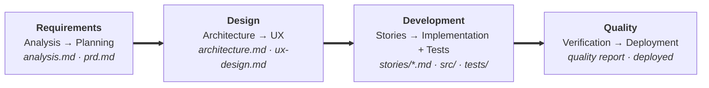
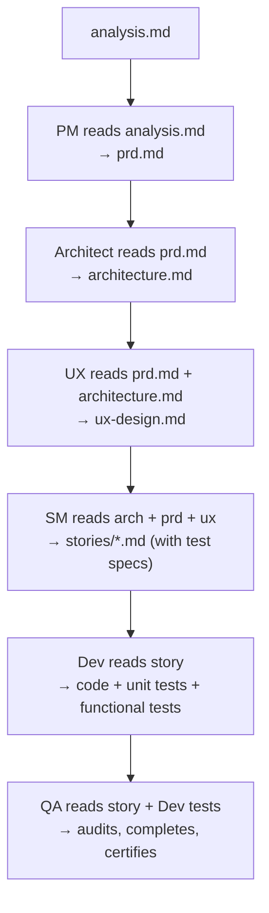
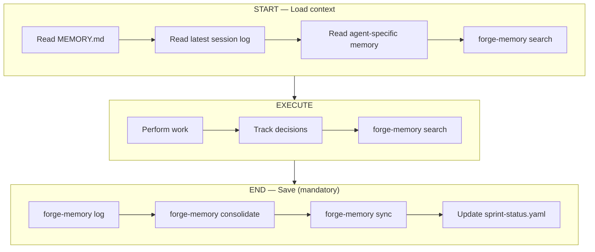
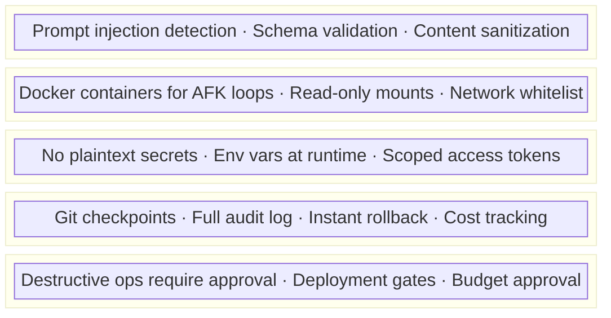

# FORGE — Framework for Orchestrated Resilient Generative Engineering

## French Language Rule

All content generated in French MUST use proper accents (é, è, ê, à, ù, ç, ô, î, etc.), follow French grammar rules (agreements, conjugations), and use correct spelling.

## Philosophy

FORGE unifies five paradigms into one secure, production-grade system:

| Paradigm                      | What FORGE Takes                                                  | What FORGE Improves                                                  |
| ----------------------------- | ----------------------------------------------------------------- | -------------------------------------------------------------------- |
| **Multi-Agent Agile**         | Agent personas, artifact-driven workflows, scale-adaptive planning | Lighter agent definitions, no npm installer dependency               |
| **Autonomous Iteration**      | Iteration loops, exit detection, rate limiting                     | Sandboxed execution, cost caps, rollback gates                       |
| **Claude Skills**             | Progressive disclosure, SKILL.md structure, scripts/references     | Native integration, auto-discovery                                   |
| **Persistent Memory**         | Project memory, session tracking, agent-specific context           | Vector search index, auto-sync, `forge-memory` CLI tooling           |
| **Workflow Automation (n8n)** | Webhook triggers, MCP bridge, pipeline orchestration               | Declarative workflow-as-code, version-controlled pipelines           |

## Quick Start

```bash
# 1. Initialize FORGE in any project
/forge-init

# 2. Choose track based on project scale
#    → Quick (bug fix, small feature): 3 commands
#    → Standard (feature, module): full pipeline
#    → Enterprise (system, platform): all agents + governance

# 3. Run the pipeline
/forge-analyze    # Agent: Analyst → Domain research, requirements
/forge-plan       # Agent: PM → PRD artifact
/forge-architect  # Agent: Architect → Architecture artifact
/forge-ux         # Agent: UX → UX design, wireframes, accessibility
/forge-stories    # Agent: SM → Stories with test specs
/forge-build      # Agent: Dev → Code + unit tests + functional tests
/forge-verify     # Agent: QA → Audit Dev tests + advanced tests + certification
/forge-deploy     # Automated deployment pipeline

# Autopilot mode — FORGE decides everything
/forge-auto           # Full pipeline, FORGE drives
/forge-auto "goal"    # Autopilot with specific objective

# Multi-agent collaboration
/forge-party "topic"  # Launch 2-3 agents in parallel on a topic
/forge-status         # Sprint status, stories, metrics

# Quick commands
/forge-quick-spec     # Quick track: spec + implement
/forge-quick-test     # Quick QA: zero-config testing
/forge-review <path>  # Adversarial review of an artifact
/forge-loop "task"    # Autonomous iteration loop
/forge-audit          # Security audit (Enterprise track)
/forge-audit-skill <path>  # Security audit of a third-party skill
/forge-update         # Update FORGE skills from latest release

# Parallel execution (requires Agent Teams)
/forge-team pipeline "goal"    # Full pipeline with parallel stories
/forge-team build STORY-001 STORY-002  # Parallel story implementation
```

---

## 1. AGENTS — Multi-Agent Personas

FORGE agents are lightweight Markdown personas. Each agent is a role Claude adopts
with specific expertise, constraints, and outputs.

### 1.1 Agent Registry

Load agent definitions from `~/.claude/skills/forge/references/agents/` only when needed.

| Agent            | Role                                                            | Trigger             | Output Artifact                         |
| ---------------- | --------------------------------------------------------------- | ------------------- | --------------------------------------- |
| **Orchestrator** | Meta-agent, routing, party mode, parallelization                | `/forge-party`      | Orchestration plan                      |
| **Analyst**      | Requirements elicitation, domain research                       | `/forge-analyze`    | `docs/analysis.md`                      |
| **PM**           | Product requirements, user stories, prioritization              | `/forge-plan`       | `docs/prd.md`                           |
| **Architect**    | System design, tech stack, API contracts                        | `/forge-architect`  | `docs/architecture.md`                  |
| **UX**           | User research, wireframes, accessibility                        | `/forge-ux`         | `docs/ux-design.md`                     |
| **Dev**          | Implementation, code generation, unit + functional tests        | `/forge-build`      | Source code + tests                     |
| **SM**           | Story decomposition, sprint planning, context sharding          | `/forge-stories`    | `docs/stories/*.md`                     |
| **QA**           | Audit Dev tests, advanced tests (8 TEA workflows), validation   | `/forge-verify`     | Quality report + supplementary tests    |
| **Quick QA**     | Zero-config testing, automatic framework detection              | `/forge-quick-test` | Tests + quick report                    |
| **Reviewer**     | Adversarial review, devil's advocate                            | `/forge-review`     | Critical review report                  |
| **DevOps**       | CI/CD, deployment, infrastructure                               | `/forge-deploy`     | Pipeline configs                        |
| **Security**     | Threat modeling, audit, compliance                              | `/forge-audit`      | `docs/security.md`                      |

### 1.2 Agent Invocation Pattern

```markdown
## Activating an Agent

When user requests `/forge-plan`, Claude:

1. Reads `~/.claude/skills/forge/references/agents/pm.md` for persona definition
2. Adopts the PM persona (expertise, constraints, output format)
3. Runs the associated workflow (elicitation → drafting → validation)
4. Produces the artifact in `docs/`
5. Returns to base Claude persona
```

### 1.3 Scale-Adaptive Intelligence

FORGE auto-detects project scale and adjusts depth. Tracks determine **what** agents run (based on project scope). Execution modes (Manual, Autopilot, Agent Teams — see Quick Start) determine **how** they run. The two are orthogonal: a Standard track project can be executed in Manual, Autopilot, or Agent Teams mode.

- **Quick Track** (bug fix, hotfix, <1 day):
  - Skip: Analysis, Architecture, Stories
  - Run: `/forge-quick-spec` → generates spec + implements
  - Agents: Dev only
  - Tests: Dev writes unit + functional tests for the fix

- **Standard Track** (feature, module, 1-5 days):
  - Run: Plan → Architect → Stories (with test specs) → Build (code + tests) → Verify (audit + advanced tests)
  - Agents: PM, Architect, SM, Dev, QA
  - Tests: SM specifies → Dev writes unit + functional → QA audits + completes

- **Enterprise Track** (system, platform, 5+ days):
  - Run: Full lifecycle with governance gates
  - Agents: All + Security + DevOps
  - Extras: ADRs, threat model, compliance checks
  - Tests: Complete + performance + security + cross-module E2E

---

## 2. WORKFLOWS — Structured Pipelines

### 2.1 Core Development Pipeline



### 2.2 Artifact-Driven Context

Every phase produces a versioned artifact. Downstream agents consume upstream artifacts,
eliminating context loss:



### 2.3 Integrated Test Strategy (Test-Driven Story Development)

Tests are integrated at EVERY stage of the pipeline, not just the verification phase.

#### Responsibilities per Agent

```
SM (/forge-stories)  → Specifies tests in each story:
                        - Unit test cases (TU-x) per function/component
                        - Mapping AC-x → functional test
                        - Test data / fixtures
                        - Test files to create

Dev (/forge-build)   → Writes AND runs tests alongside code:
                        - Unit tests BEFORE code (TDD)
                        - Functional tests for each AC-x
                        - Coverage >80% on new code
                        - Story NOT done if tests fail

QA (/forge-verify)   → Audits, completes, and certifies:
                        - Audit: did the Dev write all required tests?
                        - Completes: integration, E2E, performance, security tests
                        - Certifies: GO/NO-GO verdict
```

#### Test Structure

```
tests/
├── unit/                    # Unit tests (Dev) — per module
│   ├── <module>/
│   │   └── <file>.test.<ext>
├── functional/              # Functional tests (Dev) — per feature
│   ├── <feature>/
│   │   └── <scenario>.test.<ext>
├── integration/             # Integration tests (QA) — cross-component
│   └── <scenario>.test.<ext>
├── e2e/                     # E2E tests (QA) — full user journeys
│   └── <journey>.test.<ext>
├── fixtures/                # Shared test data
│   └── <name>.fixture.<ext>
└── helpers/                 # Test utilities
    └── setup.<ext>
```

#### Validation Gate

No story moves to "done" without:

- Unit tests present and passing (>80% coverage)
- Functional tests present for each AC-x and passing
- Non-regression validated (pre-existing tests not broken)

### 2.4 n8n Workflow Integration (Conceptual)

> This describes planned n8n integration patterns. See section 6 for full details.

See `~/.claude/skills/forge/n8n-integration.md` for design patterns:

- Webhook-triggered build pipelines
- MCP server exposure of FORGE commands
- Automated deployment workflows
- Monitoring and alerting patterns

### 2.5 Document Sharding (Conceptual — token optimization)

> This describes a planned optimization pattern. Currently, agents load full artifacts.

Large artifacts could be split into sections to optimize token consumption.
Each agent would only load the sections relevant to its work.

```
# Principle: split on ## (heading level 2)

docs/prd.md (complete)
  → Section "Functional Requirements" → loaded by SM, Dev
  → Section "Non-Functional Requirements" → loaded by Architect, QA
  → Section "User Stories" → loaded by SM
  → Section "Constraints" → loaded by all

# Sharding rules:
# - An agent NEVER loads an entire artifact if it doesn't need it
# - Sections are identified by their ## heading
# - The Orchestrator determines the relevant sections per agent
```

### 2.6 Artifact Modes (Create / Validate / Edit)

Each artifact supports 3 operating modes:

| Mode         | When                                       | Behavior                                             |
| ------------ | ------------------------------------------ | ---------------------------------------------------- |
| **Create**   | Artifact does not exist                    | Full generation from scratch                         |
| **Validate** | Artifact exists, verification requested    | Checks consistency, completeness, compliance         |
| **Edit**     | Artifact exists, modifications requested   | Incremental update, preserves valid content          |

```
# Automatic mode detection:
# - If docs/prd.md does not exist → Create mode
# - If /forge-plan --validate → Validate mode
# - If /forge-plan "add feature X" → Edit mode (PRD already exists)
```

### 2.7 Sprint Status (/forge-status)

FORGE maintains a `.forge/sprint-status.yaml` file for tracking:

```yaml
# Read via /forge-status
sprint:
  id: 1
  started_at: 'YYYY-MM-DD'
  stories:
    - id: story-001
      title: '...'
      status: completed # pending | in_progress | completed | blocked
      assigned_to: dev
      blockedBy: []
    - id: story-002
      title: '...'
      status: in_progress
      assigned_to: dev
      blockedBy: [story-001]
  metrics:
    total: 5
    completed: 2
    in_progress: 1
    blocked: 0
    pending: 2
    velocity: '2 stories/day'
```

---

## 3. AUTONOMOUS LOOPS — Iteration Engine

### 3.1 Loop Architecture

FORGE provides autonomous iteration with security guardrails:

```bash
# FORGE Autonomous Loop
/forge-loop "Implement authentication module" --max-iterations 20 --sandbox docker

# How it works:
# 1. Claude receives task + PROMPT.md
# 2. Works on implementation
# 3. Tries to exit → Stop hook intercepts
# 4. Same prompt re-fed with file system state
# 5. Loop continues until:
#    a. Completion criteria met (tests pass + EXIT_SIGNAL)
#    b. Max iterations reached
#    c. Cost cap hit
#    d. Circuit breaker triggers (repeated errors)
```

### 3.2 Security Guardrails

```yaml
# .forge/config.yml — Loop Security
loop:
  max_iterations: 30 # Hard cap
  cost_cap_usd: 10.00 # Per-loop spending limit
  timeout_minutes: 60 # Per-iteration timeout
  mode: hitl # afk | hitl | pair
  rate_limit_per_hour: 60 # Max iterations per hour
  state_directory: .forge-state/ # State persistence
  sandbox:
    enabled: true # ALWAYS for AFK loops
    provider: docker # docker | local | none
    mount_readonly: # Read-only mounts
      - ./docs
      - ./references
    mount_readwrite: # Read-write mounts
      - ./src
      - ./tests
    network: restricted # No outbound except allowed domains
    allowed_domains: # Whitelist for network access
      - registry.npmjs.org
      - pypi.org
  circuit_breaker:
    consecutive_errors: 3 # Stop after 3 consecutive failures
    no_progress_iterations: 5 # Stop if no git diff for N iterations
    same_output_repeats: 3 # Stop if same output repeated N times
  rollback_gate:
    enabled: true # Git tag checkpoint before each iteration
    max_checkpoints: 5 # Keep last N checkpoints
```

### 3.3 Loop Modes

| Mode     | Behavior             | HITL Gates                          | Usage              |
| -------- | -------------------- | ----------------------------------- | ------------------ |
| **afk**  | Fully autonomous     | None                                | Overnight, batch   |
| **hitl** | Semi-autonomous      | Confirmation every 5 iterations     | Default            |
| **pair** | Collaborative        | Continuous explanation, small commits| Active development |

```bash
# Examples
/forge-loop "task" --mode afk --max-iterations 50   # Overnight
/forge-loop "task" --mode hitl                       # Default
/forge-loop "task" --mode pair                       # Pair programming
```

### 3.4 State Management

Each loop maintains its state in `.forge-state/`:

```
.forge-state/
├── state.json      # Current state (iteration, errors, mode, status)
├── history.jsonl   # Complete event history
└── fix_plan.md     # In-loop task plan
```

### 3.5 Checkpoint and Rollback

```bash
# Automatic checkpoints via git tags
# Each iteration creates: forge-ckpt-iter-N
# The last 5 are kept

# List checkpoints
forge-loop.sh checkpoint-list

# Restore a checkpoint
forge-loop.sh rollback --story forge-ckpt-iter-5
```

### 3.6 PROMPT.md Template

The PROMPT.md template is automatically generated by `forge-loop.sh` and includes:

- Task description
- Story context (if provided)
- Reference to fix_plan.md for tracking
- Mode-specific instructions (afk/hitl/pair)
- Completion criteria
- Current state (iteration, errors, progress)

See `~/.claude/skills/forge/loop-patterns.md` for advanced patterns.

---

## 4. PERSISTENT MEMORY — Project Continuity

### 4.1 Memory Architecture

FORGE maintains persistent Markdown-based memory to ensure continuity across sessions.
Every FORGE **agent command** reads memory at start and writes updates at end (see protocol in 4.3).

```
.forge/memory/
├── MEMORY.md                    # Core project knowledge (long-term)
├── sessions/
│   ├── YYYY-MM-DD.md            # Daily session log
│   └── ...
└── agents/
    ├── pm.md                    # PM agent-specific memory
    ├── architect.md             # Architect decisions log
    ├── dev.md                   # Dev patterns, gotchas
    └── qa.md                    # QA coverage state, known issues
```

### 4.2 Two-Layer Memory

| Layer              | File                              | Purpose                              | Updated By          |
| ------------------ | --------------------------------- | ------------------------------------ | ------------------- |
| **Long-term**      | `.forge/memory/MEMORY.md`         | Project state, decisions, milestones | All agents          |
| **Session**        | `.forge/memory/sessions/DATE.md`  | Daily log of what was done           | Auto per session    |
| **Agent-specific** | `.forge/memory/agents/AGENT.md`   | Context specific to each agent role  | Respective agent    |

### 4.3 Memory Protocol

Every FORGE **agent command** follows this protocol (utility commands like `/forge-status`, `/forge-resume`, and `/forge-init` read memory but do not write back via `forge-memory log`):



### 4.4 Memory + Autopilot Integration

The memory system is what makes `/forge-auto` intelligent:

- FORGE reads MEMORY.md to know exactly where the project is
- It reads session logs to understand recent activity and avoid repeating work
- It reads agent memories to provide continuity to each agent role
- On resume, FORGE picks up exactly where it left off

### 4.5 Memory Configuration

```yaml
# .forge/config.yml
memory:
  enabled: true          # Enable persistent memory
  auto_save: true        # Auto-save after each command
  session_logs: true     # Keep daily session logs
  agent_memory: true     # Per-agent memory files
```

### 4.6 Vector Search

FORGE enriches its Markdown memory with a SQLite vector index for fast semantic search.

#### Architecture

```
.forge/memory/
  MEMORY.md              <- source of truth
  sessions/YYYY-MM-DD.md <- source of truth
  agents/{agent}.md      <- source of truth
  index.sqlite           <- derived index (auto-synced)
```

- **One-way sync**: Markdown = master, SQLite = derived index
- **Auto-sync**: modified files are re-indexed before each search
- **Hybrid search**: vector similarity (70%) + FTS5 BM25 keywords (30%)
- **Local embeddings**: `all-MiniLM-L6-v2` (384 dims, ~80 MB)
- **Markdown-aware chunking**: ~400 tokens/chunk, respects headings and code blocks

The memory protocol in section 4.3 already includes vector search at steps 4 and 7.
When vector search is not installed, those steps are silently skipped.

#### Installation

```bash
bash ~/.claude/skills/forge/scripts/forge-memory/setup.sh
```

#### CLI Commands

```bash
forge-memory sync [--force] [--verbose]                                           # Re-index .md files into SQLite
forge-memory search "query" [--namespace all|project|session|agent] [--limit 5]   # Hybrid vector + keyword search
forge-memory log "<message>" --agent <name>                                       # Append to session log
forge-memory consolidate [--verbose]                                              # Merge session entries into MEMORY.md
forge-memory status [--json]                                                      # Index statistics
forge-memory reset --confirm                                                      # Reset the vector index
```

---

## 5. SECURITY MODEL

### 5.1 Threat Model

FORGE addresses the "Lethal Trifecta" (Simon Willison, 2025):

1. **Untrusted input** → All external data treated as potentially hostile
2. **Tool access** → Least privilege, sandbox isolation
3. **Autonomous execution** → Human-in-the-loop gates for destructive actions

### 5.2 Security Layers



### 5.3 Skill Validation (from Cisco research on OpenClaw)

Before loading any third-party skill:

```bash
# Validate skill for security threats
/forge-audit-skill <path-to-skill>

# Checks:
# - No suspicious network calls in scripts
# - No credential harvesting patterns
# - No prompt injection in SKILL.md
# - No file access outside declared scope
# - Dependencies audited (npm audit / pip audit)
```

---

## 6. MCP INTEGRATION (Conceptual)

> This section describes planned MCP integration patterns. These are not yet implemented
> as code — they serve as a design reference for future development. See
> `~/.claude/skills/forge/n8n-integration.md` for the integration guide.

### 6.1 FORGE as MCP Server (Planned)

FORGE could expose its capabilities as MCP tools for external clients.

```typescript
// FORGE MCP Server — exposes development tools
tools: [
  'forge_analyze', // Run analysis phase
  'forge_plan', // Generate PRD
  'forge_architect', // Generate architecture
  'forge_build', // Run implementation loop
  'forge_verify', // Run test suite
  'forge_deploy', // Deploy to environment
  'forge_status', // Get project status
  'forge_loop', // Start autonomous loop
];
```

### 6.2 Consuming MCP Servers (Planned)

FORGE could connect to external MCP servers for enhanced capabilities:

```yaml
# .forge/mcp-servers.yml
servers:
  n8n:
    url: 'http://localhost:5678/mcp'
    auth: api_key
    tools: [create_workflow, execute_workflow, list_workflows]

  github:
    url: 'https://mcp.github.com'
    auth: oauth
    tools: [create_issue, create_pr, list_issues]

  database:
    url: 'http://localhost:3001/mcp'
    auth: api_key
    tools: [query, migrate, backup]
    readonly: true # Security: read-only by default
```

### 6.3 n8n Workflow Automation (Planned)

FORGE could generate n8n workflows for CI/CD automation:

```json
{
  "name": "FORGE Deploy Pipeline",
  "nodes": [
    { "type": "webhook", "name": "Git Push Trigger" },
    { "type": "claude-code", "name": "Run Tests", "params": { "prompt": "/forge-verify" } },
    { "type": "if", "name": "Tests Pass?" },
    { "type": "claude-code", "name": "Build", "params": { "prompt": "/forge-build --production" } },
    { "type": "ssh", "name": "Deploy to Server" },
    { "type": "slack", "name": "Notify Team" }
  ]
}
```

---

## 7. PROJECT SCAFFOLDING

### 7.1 /forge-init Command

Initialize FORGE in any project:

```
project-root/
├── .forge/
│   ├── config.yml          # FORGE configuration
│   ├── memory/             # Persistent memory
│   │   ├── MEMORY.md       # Core project knowledge
│   │   ├── sessions/       # Daily session logs
│   │   └── agents/         # Agent-specific memories
├── docs/
│   ├── analysis.md         # Analyst output
│   ├── prd.md              # PM output
│   ├── architecture.md     # Architect output
│   ├── security.md         # Security audit
│   ├── adrs/               # Architecture Decision Records (Enterprise)
│   └── stories/            # SM output (stories with test specs)
│       ├── story-001.md
│       └── ...
├── src/                    # Source code (Dev output)
├── tests/                  # Tests (Dev + QA output)
│   ├── unit/               # Unit tests per module (Dev)
│   ├── functional/         # Functional tests per feature (Dev)
│   ├── integration/        # Integration tests (QA)
│   ├── e2e/                # E2E tests (QA)
│   ├── fixtures/           # Shared test data
│   └── helpers/            # Test utilities
├── CLAUDE.md               # Project conventions (auto-generated)
└── PROMPT.md               # Loop prompt (when using /forge-loop)
```

### 7.2 CLAUDE.md Auto-Generation

FORGE generates a `CLAUDE.md` tailored to the project (via `forge-init.sh`):

```markdown
# CLAUDE.md — Generated by FORGE

## Project
- **Name**: <auto-detected>
- **Type**: <auto-detected>
- **Language**: <auto-detected>

## FORGE Commands
- `/forge-plan` — Generate/update PRD (PM agent)
- `/forge-architect` — Generate/update architecture (Architect agent)
- `/forge-stories` — Generate stories from PRD + architecture (SM agent)
- `/forge-build` — Implement current story (Dev agent)
- `/forge-loop "task"` — Autonomous iteration loop
- `/forge-verify` — Run tests and validation (QA agent)
- `/forge-deploy` — Deploy to configured environment
- `/forge-status` — Project status overview
- `/forge-audit` — Security audit (Security agent)

## Conventions
- **Commits**: Conventional format — `type(scope): description`
- **Tests**: Required for all production code
- **Branches**: `feature/`, `fix/`, `forge/loop-` prefixes
- **Secrets**: NEVER in code — use environment variables

## Architecture
See `docs/architecture.md` when available.
```

---

## 8. CONFIGURATION

### 8.1 .forge/config.yml

```yaml
project:
  name: 'my-project'
  type: auto-detect # web-app | api | library | cli | mobile
  language: auto-detect # typescript | python | go | rust | etc.
  scale: auto-detect # quick | standard | enterprise

agents:
  default_set: standard # quick | standard | enterprise | custom
  custom_agents: [] # Path to custom agent definitions

loop:
  max_iterations: 30
  cost_cap_usd: 10.00
  sandbox:
    enabled: true
    provider: docker

memory:
  enabled: true
  auto_save: true
  session_logs: true
  agent_memory: true
  vector_search:
    enabled: false     # requires Python 3.9+ setup
    model: "all-MiniLM-L6-v2"
    auto_sync: true

security:
  audit_skills: true # Validate third-party skills
  sandbox_loops: true # Sandbox all autonomous loops
  credential_store: env # env | vault | keyring
  allowed_domains: [] # Network whitelist for sandbox

mcp:
  servers: [] # External MCP server connections
  expose: false # Expose FORGE as MCP server

n8n:
  enabled: false
  instance_url: ''
  api_key_env: 'N8N_API_KEY' # Env var name (NOT the key itself)

deploy:
  provider: '' # hostinger | docker | k8s | vercel | custom
  staging_url: ''
  production_url: ''
  require_approval: true # Human gate for production deploy
```

### 8.2 Token Saver

Output filtering hooks that reduce shell output token consumption. Installed by `install.sh` (or manually via `forge-init.sh`), these hooks intercept verbose command output (npm install, test runners, build logs) and compress it to save context window tokens.

```
hooks/
  token-saver.sh         # Shell hook: filters stdout/stderr
  output-filter.js       # Node.js filter: parses and compresses output
```

Installed to `~/.claude/hooks/` — active for all Claude Code sessions.

---

## 9. REFERENCE FILES

Load these resources as needed during development:

### Agent Definitions

- `~/.claude/skills/forge/references/agents/orchestrator.md` — Orchestrator meta-agent, party mode
- `~/.claude/skills/forge/references/agents/analyst.md` — Analyst persona, domain research
- `~/.claude/skills/forge/references/agents/pm.md` — Product Manager persona
- `~/.claude/skills/forge/references/agents/architect.md` — Architect persona
- `~/.claude/skills/forge/references/agents/ux.md` — UX/Design persona, wireframes, accessibility
- `~/.claude/skills/forge/references/agents/dev.md` — Developer persona, TDD
- `~/.claude/skills/forge/references/agents/sm.md` — Scrum Master persona
- `~/.claude/skills/forge/references/agents/qa.md` — QA/TEA persona (8 workflows)
- `~/.claude/skills/forge/references/agents/quick-qa.md` — Quick QA, zero-config testing
- `~/.claude/skills/forge/references/agents/reviewer.md` — Adversarial reviewer
- `~/.claude/skills/forge/references/agents/devops.md` — DevOps persona
- `~/.claude/skills/forge/references/agents/security.md` — Security persona

### Integration Guides

- `~/.claude/skills/forge/n8n-integration.md` — n8n workflow patterns, MCP bridge setup
- `~/.claude/skills/forge/loop-patterns.md` — Autonomous loop patterns, prompt engineering
- `~/.claude/skills/forge/security-model.md` — Detailed security architecture

### Scripts

- `~/.claude/skills/forge/forge-init.sh` — Project initialization
- `~/.claude/skills/forge/forge-loop.sh` — Secured autonomous loop runner
- `~/.claude/skills/forge/audit-skill.py` — Skill security auditor
