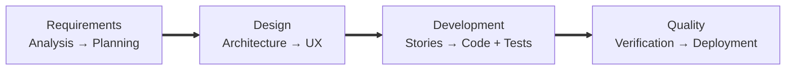

# FORGE — Framework for Orchestrated Resilient Generative Engineering

## French Language Rule

All content generated in French MUST use proper accents (é, è, ê, à, ù, ç, ô, î, etc.), follow French grammar rules (agreements, conjugations), and use correct spelling.

## Philosophy

FORGE unifies five paradigms into one secure, production-grade system:

| Paradigm                      | What FORGE Takes                                                  | What FORGE Improves                                                  |
| ----------------------------- | ----------------------------------------------------------------- | -------------------------------------------------------------------- |
| **Multi-Agent Agile**         | Agent personas, artifact-driven workflows, scale-adaptive planning | Lighter agent definitions, no npm installer dependency               |
| **Autonomous Iteration**      | Iteration loops, exit detection, rate limiting                     | Sandboxed execution, cost caps, rollback gates                       |
| **Claude Skills**             | Progressive disclosure, SKILL.md structure, scripts/references     | Native integration, auto-discovery                                   |
| **Persistent Memory**         | Project memory, session tracking, agent-specific context           | Vector search index, auto-sync, `forge-memory` CLI tooling           |
| **Workflow Automation (n8n)** | Webhook triggers, MCP bridge, pipeline orchestration               | Declarative workflow-as-code, version-controlled pipelines           |

## Quick Start

```bash
# 1. Initialize FORGE in any project
/forge-init

# 2. Choose track based on project scale
#    → Quick (bug fix, small feature): 3 commands
#    → Standard (feature, module): full pipeline
#    → Enterprise (system, platform): all agents + governance

# 3. Run the pipeline
/forge-analyze    # Agent: Analyst → Domain research, requirements
/forge-plan       # Agent: PM → PRD artifact
/forge-architect  # Agent: Architect → Architecture artifact
/forge-ux         # Agent: UX → UX design, wireframes, accessibility
/forge-stories    # Agent: SM → Stories with test specs
/forge-build      # Agent: Dev → Code + unit tests + functional tests
/forge-verify     # Agent: QA → Audit Dev tests + advanced tests + certification
/forge-deploy     # Automated deployment pipeline

# Autopilot mode — FORGE decides everything
/forge-auto           # Full pipeline, FORGE drives
/forge-auto "goal"    # Autopilot with specific objective

# Multi-agent collaboration
/forge-party "topic"  # Launch 2-3 agents in parallel on a topic
/forge-status         # Sprint status, stories, metrics

# Quick commands
/forge-quick-spec     # Quick track: spec + implement
/forge-quick-test     # Quick QA: zero-config testing
/forge-review [path]  # Adversarial review of an artifact
/forge-loop "task"    # Autonomous iteration loop
/forge-audit          # Security audit (Enterprise track)
/forge-audit-skill [path]  # Security audit of a third-party skill
/forge-update         # Update FORGE skills from latest release

# Parallel execution (requires Agent Teams)
/forge-team pipeline "goal"    # Full pipeline with parallel stories
/forge-team build STORY-001 STORY-002  # Parallel story implementation
```

---

## 1. AGENTS — Multi-Agent Personas

FORGE agents are lightweight Markdown personas. Each agent is a role Claude adopts
with specific expertise, constraints, and outputs.

### Agent Registry

Load agent definitions from `~/.claude/skills/forge/references/agents/` only when needed.

| Agent            | Role                                                            | Trigger             | Output Artifact                         |
| ---------------- | --------------------------------------------------------------- | ------------------- | --------------------------------------- |
| **Orchestrator** | Meta-agent, routing, party mode, parallelization                | `/forge-party`      | Orchestration plan                      |
| **Analyst**      | Requirements elicitation, domain research                       | `/forge-analyze`    | `docs/analysis.md`                      |
| **PM**           | Product requirements, user stories, prioritization              | `/forge-plan`       | `docs/prd.md`                           |
| **Architect**    | System design, tech stack, API contracts                        | `/forge-architect`  | `docs/architecture.md`                  |
| **UX**           | User research, wireframes, accessibility                        | `/forge-ux`         | `docs/ux-design.md`                     |
| **Dev**          | Implementation, code generation, unit + functional tests        | `/forge-build`      | Source code + tests                     |
| **SM**           | Story decomposition, sprint planning, context sharding          | `/forge-stories`    | `docs/stories/*.md`                     |
| **QA**           | Audit Dev tests, advanced tests (8 TEA workflows), validation   | `/forge-verify`     | Quality report + supplementary tests    |
| **Quick QA**     | Zero-config testing, automatic framework detection              | `/forge-quick-test` | Tests + quick report                    |
| **Reviewer**     | Adversarial review, devil's advocate                            | `/forge-review`     | Critical review report                  |
| **DevOps**       | CI/CD, deployment, infrastructure                               | `/forge-deploy`     | Pipeline configs                        |
| **Security**     | Threat modeling, audit, compliance                              | `/forge-audit`      | `docs/security.md`                      |

### Agent Invocation Pattern

When user requests a FORGE command, Claude:

1. Reads the agent persona from `references/agents/`
2. Adopts the persona (expertise, constraints, output format)
3. Runs the associated workflow
4. Produces the artifact in `docs/`
5. Returns to base Claude persona

### Scale-Adaptive Intelligence

FORGE auto-detects project scale and adjusts depth. Tracks determine **what** agents run; execution modes (Manual, Autopilot, Agent Teams) determine **how** they run.

- **Quick Track** (bug fix, hotfix): Skip Analysis/Architecture/Stories → `/forge-quick-spec` → Dev only
- **Standard Track** (feature, 1-5 days): Plan → Architect → Stories → Build → Verify (PM, Architect, SM, Dev, QA)
- **Enterprise Track** (system, 5+ days): Full lifecycle with governance, Security + DevOps, ADRs, compliance

---

## 2. WORKFLOWS — Structured Pipelines

### Core Development Pipeline


```mermaid
flowchart LR
    R["Requirements\nAnalysis → Planning"] ==> D["Design\nArchitecture → UX"]
    D ==> DEV["Development\nStories → Code + Tests"]
    DEV ==> Q["Quality\nVerification → Deployment"]
```

Each phase produces a versioned artifact consumed by downstream agents, eliminating context loss.

**For detailed workflow documentation** (artifact chain, test strategy, sharding, artifact modes, sprint status), read `~/.claude/skills/forge/references/workflows.md`.

---

## 3. AUTONOMOUS LOOPS — Iteration Engine

FORGE provides autonomous iteration with security guardrails via `/forge-loop`:

- **3 modes**: afk (fully autonomous), hitl (semi-autonomous, default), pair (collaborative)
- **Security**: cost caps, sandbox isolation, circuit breakers, rollback checkpoints
- **State**: persisted in `.forge-state/` (state.json, history.jsonl, fix_plan.md)

**For detailed loop documentation** (architecture, security config, state management, checkpoints), read `~/.claude/skills/forge/references/loops.md`.

---

## 4. PERSISTENT MEMORY — Project Continuity

FORGE maintains persistent Markdown-based memory in `.forge/memory/`:

- **MEMORY.md**: Core project knowledge (long-term)
- **sessions/**: Daily session logs
- **agents/**: Per-agent context (pm.md, architect.md, dev.md, qa.md)
- **Vector search**: SQLite index with hybrid search (70% vector + 30% FTS5 BM25)

Every agent command reads memory at start and writes updates at end (mandatory protocol).

**For detailed memory documentation** (architecture, protocol, vector search, CLI commands), read `~/.claude/skills/forge/references/memory.md`.

---

## 5. SECURITY MODEL

5-layer defense: Input Validation → Sandbox Isolation → Credential Management → Audit/Rollback → Human Gates.

**For detailed security documentation** (threat model, security layers, skill validation), read `~/.claude/skills/forge/references/security.md`.

---

## 6. MCP INTEGRATION (Conceptual)

Planned patterns for FORGE as MCP server, consuming external MCP servers, and n8n workflow automation.

**For detailed MCP documentation**, read `~/.claude/skills/forge/references/mcp-integration.md`.

---

## 7. CONFIGURATION & SCAFFOLDING

Initialize with `/forge-init`. Configuration via `.forge/config.yml` (project, agents, loop, memory, security, MCP, deploy).

**For detailed configuration documentation** (config.yml reference, token saver, project scaffolding, CLAUDE.md generation), read `~/.claude/skills/forge/references/configuration.md`.

---

## 8. REFERENCE FILES

Load these resources as needed during development:

### Agent Definitions

- `references/agents/orchestrator.md` — Orchestrator meta-agent, party mode
- `references/agents/analyst.md` — Analyst persona, domain research
- `references/agents/pm.md` — Product Manager persona
- `references/agents/architect.md` — Architect persona
- `references/agents/ux.md` — UX/Design persona, wireframes, accessibility
- `references/agents/dev.md` — Developer persona, TDD
- `references/agents/sm.md` — Scrum Master persona
- `references/agents/qa.md` — QA/TEA persona (8 workflows)
- `references/agents/quick-qa.md` — Quick QA, zero-config testing
- `references/agents/reviewer.md` — Adversarial reviewer
- `references/agents/devops.md` — DevOps persona
- `references/agents/security.md` — Security persona

### Architecture & Workflows

- `references/workflows.md` — Artifact chain, test strategy, sharding, sprint status
- `references/loops.md` — Autonomous loop architecture, security, state management
- `references/memory.md` — Memory architecture, protocol, vector search
- `references/security.md` — Threat model, security layers, skill validation
- `references/mcp-integration.md` — MCP server patterns, n8n workflows
- `references/configuration.md` — Config reference, scaffolding, CLAUDE.md generation

### Integration Guides

- `n8n-integration.md` — n8n workflow patterns, MCP bridge setup
- `loop-patterns.md` — Autonomous loop patterns, prompt engineering
- `security-model.md` — Detailed security architecture

### Scripts

- `forge-init.sh` — Project initialization
- `forge-loop.sh` — Secured autonomous loop runner
- `audit-skill.py` — Skill security auditor
