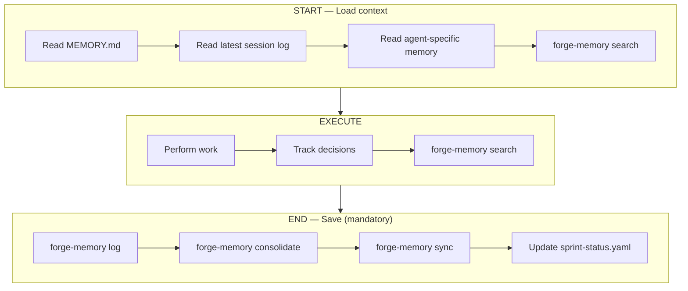

# FORGE Persistent Memory — Detailed Reference

## Memory Architecture

FORGE maintains persistent Markdown-based memory to ensure continuity across sessions.
Every FORGE **agent command** reads memory at start and writes updates at end.

```
.forge/memory/
├── MEMORY.md                    # Core project knowledge (long-term)
├── sessions/
│   ├── YYYY-MM-DD.md            # Daily session log
│   └── ...
└── agents/
    ├── pm.md                    # PM agent-specific memory
    ├── architect.md             # Architect decisions log
    ├── dev.md                   # Dev patterns, gotchas
    └── qa.md                    # QA coverage state, known issues
```

## Two-Layer Memory

| Layer              | File                              | Purpose                              | Updated By          |
| ------------------ | --------------------------------- | ------------------------------------ | ------------------- |
| **Long-term**      | `.forge/memory/MEMORY.md`         | Project state, decisions, milestones | All agents          |
| **Session**        | `.forge/memory/sessions/DATE.md`  | Daily log of what was done           | Auto per session    |
| **Agent-specific** | `.forge/memory/agents/AGENT.md`   | Context specific to each agent role  | Respective agent    |

## Memory Protocol

Every FORGE **agent command** follows this protocol (utility commands like `/forge-status`, `/forge-resume`, and `/forge-init` read memory but do not write back via `forge-memory log`):



## Memory + Autopilot Integration

The memory system is what makes `/forge-auto` intelligent:

- FORGE reads MEMORY.md to know exactly where the project is
- It reads session logs to understand recent activity and avoid repeating work
- It reads agent memories to provide continuity to each agent role
- On resume, FORGE picks up exactly where it left off

## Memory Configuration

```yaml
# .forge/config.yml
memory:
  enabled: true          # Enable persistent memory
  auto_save: true        # Auto-save after each command
  session_logs: true     # Keep daily session logs
  agent_memory: true     # Per-agent memory files
```

## Vector Search

FORGE enriches its Markdown memory with a SQLite vector index for fast semantic search.

### Architecture

```
.forge/memory/
  MEMORY.md              <- source of truth
  sessions/YYYY-MM-DD.md <- source of truth
  agents/{agent}.md      <- source of truth
  index.sqlite           <- derived index (auto-synced)
```

- **One-way sync**: Markdown = master, SQLite = derived index
- **Auto-sync**: modified files are re-indexed before each search
- **Hybrid search**: vector similarity (70%) + FTS5 BM25 keywords (30%)
- **Local embeddings**: `all-MiniLM-L6-v2` (384 dims, ~80 MB)
- **Markdown-aware chunking**: ~400 tokens/chunk, respects headings and code blocks

### Installation

```bash
bash ~/.claude/skills/forge/scripts/forge-memory/setup.sh
```

### CLI Commands

```bash
forge-memory sync [--force] [--verbose]                                           # Re-index .md files into SQLite
forge-memory search "query" [--namespace all|project|session|agent] [--limit 5]   # Hybrid vector + keyword search
forge-memory log "<message>" --agent <name>                                       # Append to session log
forge-memory consolidate [--verbose]                                              # Merge session entries into MEMORY.md
forge-memory status [--json]                                                      # Index statistics
forge-memory reset --confirm                                                      # Reset the vector index
```
