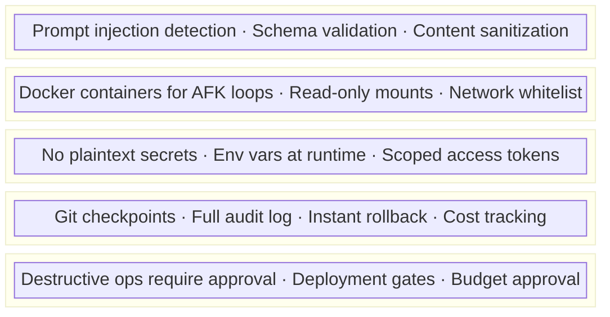

# FORGE Security Model — Detailed Reference

## Threat Model

FORGE addresses the "Lethal Trifecta" (Simon Willison, 2025):

1. **Untrusted input** → All external data treated as potentially hostile
2. **Tool access** → Least privilege, sandbox isolation
3. **Autonomous execution** → Human-in-the-loop gates for destructive actions

## Security Layers



## Skill Validation (from Cisco research on OpenClaw)

Before loading any third-party skill:

```bash
# Validate skill for security threats
/forge-audit-skill [path-to-skill]

# Checks:
# - No suspicious network calls in scripts
# - No credential harvesting patterns
# - No prompt injection in SKILL.md
# - No file access outside declared scope
# - Dependencies audited (npm audit / pip audit)
```
