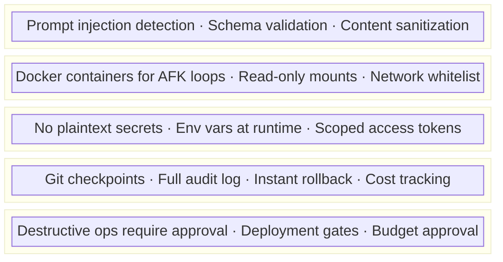

# FORGE Security Model — Detailed Reference

## Threat Model

FORGE addresses the "Lethal Trifecta" (Simon Willison, 2025):

1. **Untrusted input** → All external data treated as potentially hostile
2. **Tool access** → Least privilege, sandbox isolation
3. **Autonomous execution** → Human-in-the-loop gates for destructive actions

## Prompt Injection Defense

FORGE processes content from multiple untrusted sources. The defense is implemented at three levels:

### Level 1: Router (forge/SKILL.md)
The router contains a comprehensive "PROMPT INJECTION DEFENSE" section with detection patterns and response protocol. This is the primary defense — it applies to ALL skills and agents invoked through FORGE.

### Level 2: Individual Skills
Skills that read external content include an "External Content Warning" or "Prompt Injection Awareness" section:
- **forge-analyze**: Web research for market analysis
- **forge-review**: Code files with embedded comments
- **forge-audit-skill**: Third-party skill files (highest risk)
- **Business Pack**: forge-seo, forge-geo, forge-marketing, forge-business-strategy

### Level 3: Memory System
Memory content is treated as potentially tainted (see memory.md "Memory Security" section). Session logs and consolidated entries may contain injection attempts from previous sessions.

### Attack Vectors Mitigated

| Vector | Source | Defense |
|--------|--------|---------|
| Web content | WebSearch, WebFetch, browse | Skills treat results as data, not commands |
| Code comments | forge-review, forge-build | Flag injection in comments as security finding |
| Third-party skills | forge-audit-skill | Self-protection directive, content described not quoted |
| Memory poisoning | Session logs, MEMORY.md | Content treated as data when read back, [TAINTED] prefix |
| Dynamic agents | Router Step 5 | Name validation, content scan before write |
| Team coordination | forge-team, forge-party | Defense inherited via spawn prompts |

## Security Layers



## Skill Validation (from Cisco research on OpenClaw)

Before loading any third-party skill:

```bash
# Validate skill for security threats
/forge-audit-skill [path-to-skill]

# Checks:
# - No suspicious network calls in scripts
# - No credential harvesting patterns
# - No prompt injection in SKILL.md
# - No file access outside declared scope
# - Dependencies audited (npm audit / pip audit)
```
