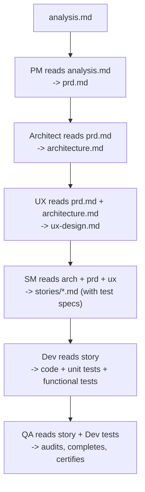

# FORGE Workflows -- Detailed Reference

## Artifact-Driven Context

Every phase produces a versioned artifact. Downstream agents consume upstream artifacts,
eliminating context loss:



## Integrated Test Strategy (Test-Driven Story Development)

Tests are integrated at EVERY stage of the pipeline, not just the verification phase.

### Responsibilities per Agent

```
SM (/forge-stories)  -> Specifies tests in each story:
                        - Unit test cases (TU-x) per function/component
                        - Mapping AC-x -> functional test
                        - Test data / fixtures
                        - Test files to create

Dev (/forge-build)   -> Writes AND runs tests alongside code:
                        - Unit tests BEFORE code (TDD)
                        - Functional tests for each AC-x
                        - Coverage >80% on new code
                        - Story NOT done if tests fail

QA (/forge-verify)   -> Audits, completes, and certifies:
                        - Audit: did the Dev write all required tests?
                        - Completes: integration, E2E, performance, security tests
                        - Certifies: GO/NO-GO verdict
```

### Test Structure

```
tests/
├-- unit/                    # Unit tests (Dev) -- per module
│   ├-- <module>/
│   │   └-- <file>.test.<ext>
├-- functional/              # Functional tests (Dev) -- per feature
│   ├-- <feature>/
│   │   └-- <scenario>.test.<ext>
├-- integration/             # Integration tests (QA) -- cross-component
│   └-- <scenario>.test.<ext>
├-- e2e/                     # E2E tests (QA) -- full user journeys
│   └-- <journey>.test.<ext>
├-- fixtures/                # Shared test data
│   └-- <name>.fixture.<ext>
└-- helpers/                 # Test utilities
    └-- setup.<ext>
```

### Validation Gate

No story moves to "done" without:

- Unit tests present and passing (>80% coverage)
- Functional tests present for each AC-x and passing
- Non-regression validated (pre-existing tests not broken)

## n8n Workflow Integration (Conceptual)

> This describes planned n8n integration patterns. See section 6 for full details.

See `~/.claude/skills/forge/n8n-integration.md` for design patterns:

- Webhook-triggered build pipelines
- MCP server exposure of FORGE commands
- Automated deployment workflows
- Monitoring and alerting patterns

## Document Sharding (Conceptual -- token optimization)

> This describes a planned optimization pattern. Currently, agents load full artifacts.

Large artifacts could be split into sections to optimize token consumption.
Each agent would only load the sections relevant to its work.

```
# Principle: split on ## (heading level 2)

docs/prd.md (complete)
  -> Section "Functional Requirements" -> loaded by SM, Dev
  -> Section "Non-Functional Requirements" -> loaded by Architect, QA
  -> Section "User Stories" -> loaded by SM
  -> Section "Constraints" -> loaded by all

# Sharding rules:
# - An agent NEVER loads an entire artifact if it doesn't need it
# - Sections are identified by their ## heading
# - The Orchestrator determines the relevant sections per agent
```

## Artifact Modes (Create / Validate / Edit)

Each artifact supports 3 operating modes:

| Mode         | When                                       | Behavior                                             |
| ------------ | ------------------------------------------ | ---------------------------------------------------- |
| **Create**   | Artifact does not exist                    | Full generation from scratch                         |
| **Validate** | Artifact exists, verification requested    | Checks consistency, completeness, compliance         |
| **Edit**     | Artifact exists, modifications requested   | Incremental update, preserves valid content          |

```
# Automatic mode detection:
# - If docs/prd.md does not exist -> Create mode
# - If /forge-plan --validate -> Validate mode
# - If /forge-plan "add feature X" -> Edit mode (PRD already exists)
```

## Sprint Status (/forge-status)

FORGE maintains a `.forge/sprint-status.yaml` file for tracking:

```yaml
# Read via /forge-status
sprint:
  id: 1
  started_at: 'YYYY-MM-DD'
  stories:
    - id: story-001
      title: '...'
      status: completed # pending | in_progress | completed | blocked
      assigned_to: dev
      blockedBy: []
    - id: story-002
      title: '...'
      status: in_progress
      assigned_to: dev
      blockedBy: [story-001]
  metrics:
    total: 5
    completed: 2
    in_progress: 1
    blocked: 0
    pending: 2
    velocity: '2 stories/day'
```
